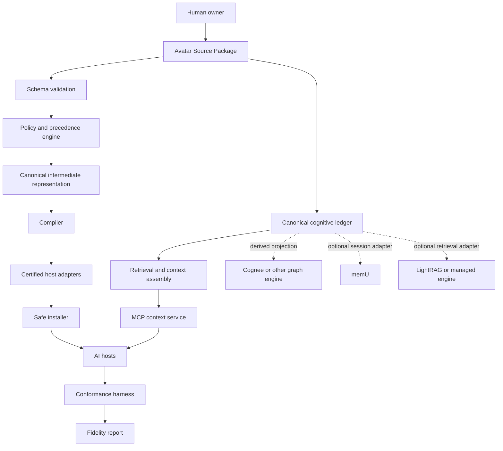
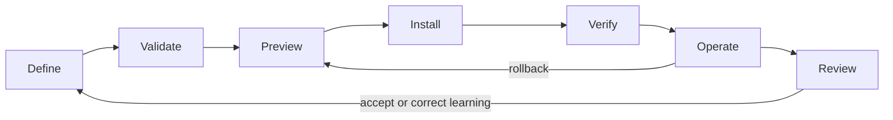
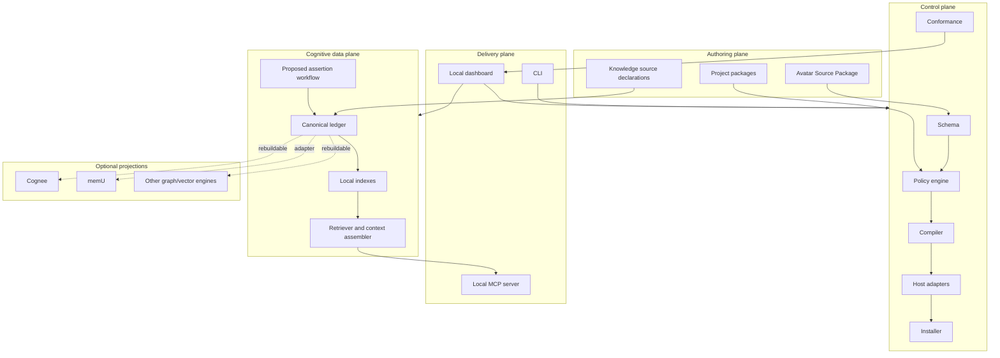
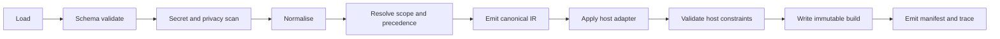
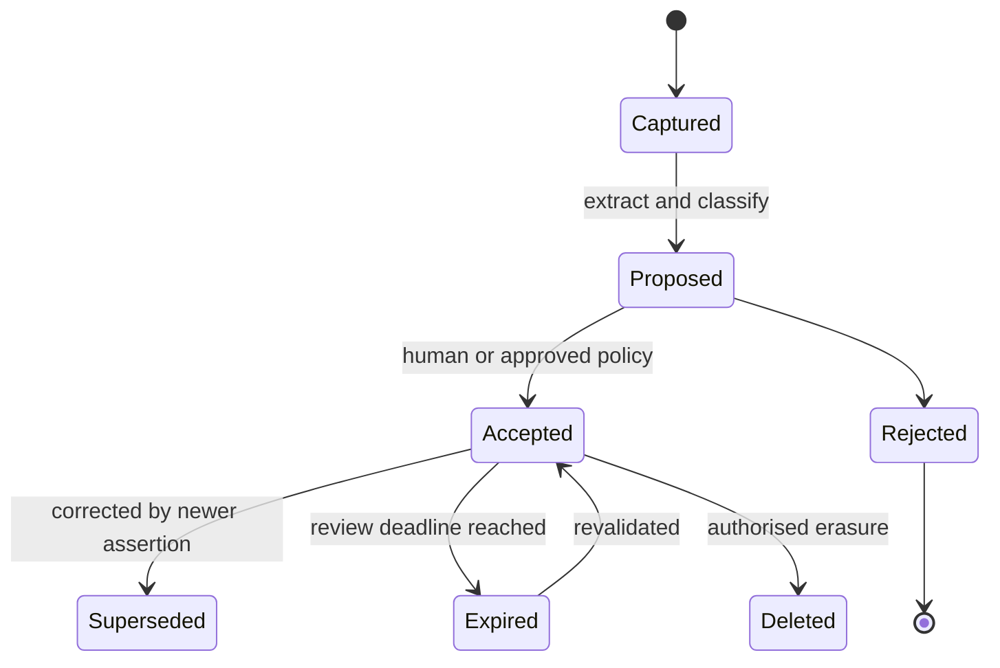

# NAAvOS Development Documentation

> Authoritative product, experience and engineering baseline for the NAAvOS repository.

| Field | Value |
|---|---|
| Product | NAAvOS |
| Repository scope | `/Users/radossagency/Documents/NAAS` only |
| Status | Development baseline, not a release declaration |
| Decision date | 13 August 2026 |
| Architecture strategy | Controlled rebuild of the prototype |
| Delivery strategy | Local-first compiler and conformance platform, then governed memory, then optional cloud |
| Intended readers | Product, design, engineering, security, open-source contributors and technical partners |

## 1. Purpose and authority

This document converts the existing NAAvOS research, productisation design and live repository evidence into one buildable development specification. It defines what the product is, how it should feel, how it should work, what is currently implemented, what is only proposed, and the release gates that prevent claims from getting ahead of reality.

This document applies only to the NAAvOS product repository. It does not authorise edits to any personal or local Avatar OS, shared runtime skill, agent configuration or external project.

### 1.1 Source-of-authority order

When two artefacts conflict, use this order:

1. Accepted architecture decision records.
2. `docs/design/NAAS-Avatar-OS-Productisation-System-Design.docx` and its PDF rendering.
3. This development document.
4. Versioned schemas, protocol contracts and conformance fixtures.
5. Executable code and observed test results, for statements about current implementation.
6. Strategy notes and research reports.
7. Marketing copy, mock-ups and prototype behaviour.

Code reality wins when answering, "What works today?" An accepted decision wins when answering, "What are we building?"

### 1.2 Evidence labels

Every future product or technical report should use these labels:

| Label | Meaning |
|---|---|
| **Observed** | Directly verified in the current checkout or a running environment. |
| **Decision** | Approved direction that implementation must follow. |
| **Target** | Designed future state that is not yet fully implemented. |
| **Assumption** | Belief requiring validation. |
| **Risk** | Condition that can damage safety, quality, adoption or delivery. |
| **Blocked** | Cannot proceed without a named dependency or decision. |

Marketing must never present a **Target** as **Observed**.

## 2. Executive build decision

### Recommendation

Build NAAvOS as an open-source cognitive operating system with two explicit planes:

1. A **control plane** that validates, compiles, installs and verifies governed avatar context across AI hosts.
2. A **cognitive data plane** that preserves evidence-backed identity, project continuity, memory and learning without allowing a third-party memory engine to become the source of truth.

The first shippable product is the local control plane. The first memory implementation is a local, canonical SQLite ledger. Cognee, memU, LightRAG, Honcho and future engines are optional adapters or derived indexes, not NAAvOS itself and not canonical authority.

### Why this is the right sequence

| Sequence | Value | Failure prevented |
|---|---|---|
| Canonical schema first | One inspectable truth model | Conflicting host instructions |
| Compiler second | Deterministic host outputs | Brittle file copying |
| Safe installer third | Reversible adoption | Broken user configuration |
| Conformance fourth | Behavioural evidence | "Installed" being mistaken for "works" |
| Canonical memory fifth | Durable continuity | Vendor lock-in and unverifiable learning |
| Optional engines sixth | Better retrieval and graph reasoning | Premature infrastructure complexity |
| Cloud last | Multi-device scale | Privacy and security debt before product truth |

### Current release decision

**NO-GO for public product release.** The current checkout contains valuable design work and a compilable landing page, but it does not yet implement the compiler, safe installer, real doctor, conformance harness, persistent memory or standards-compliant MCP server described by its public copy.

## 3. Product definition

### 3.1 Category statement

**NAAvOS is an open-source cognitive operating system that turns a governed avatar source package into portable, inspectable and testable context for AI systems, while preserving correctable memory, project continuity and provenance.**

### 3.2 Product promise

The user defines who they are, how they work, what is true, what remains uncertain, and what each project requires once. NAAvOS safely translates the relevant subset for each supported AI host, verifies the installation and measures whether the resulting agent behaviour respects the contract.

### 3.3 What NAAvOS is

- A canonical schema for identity, preferences, rules, modes, projects and knowledge sources.
- A policy and precedence engine.
- A deterministic compiler with host-specific adapters.
- A reversible installer and migration manager.
- A conformance harness and fidelity report.
- A governed, temporal and correctable cognitive ledger.
- A local MCP context service, with optional remote delivery later.
- A portable open-source substrate for different users, models, agents and memory engines.

### 3.4 What NAAvOS is not

- Not a personality quiz or fixed psychological label.
- Not a prompt synchroniser.
- Not a file-copy script.
- Not an AI model or autonomous agent.
- Not a vector database or knowledge graph product.
- Not a secrets manager.
- Not a forced replacement for existing knowledge tools.
- Not a private profile disguised as a universal product.
- Not a claim that an LLM can perfectly embody a human.

### 3.5 Core ideology

1. **Human sovereignty:** the person owns the source, permissions, corrections and deletion decisions.
2. **Truth over fluency:** provenance, confidence and time matter more than a persuasive answer.
3. **Inspectability over magic:** generated instructions, retrieval decisions and mutations must be explainable.
4. **Portability over lock-in:** providers are replaceable; the canonical package remains portable.
5. **Progressive disclosure:** a host receives the minimum relevant context, not the entire person.
6. **Correction over accumulation:** an incorrect memory must be retractable, not immortalised.
7. **Evidence over completion theatre:** health, installation and fidelity require observed proof.
8. **Local-first, cloud-optional:** the simplest useful product must work without a SaaS account.
9. **Neutral core, optional profiles:** product mechanisms are public; personal source material remains separate.
10. **Safe reversibility:** every installation or mutation has a preview, journal and rollback path.

## 4. Users, jobs and value

### 4.1 Primary users

| User | Main job | Current pain | NAAvOS outcome |
|---|---|---|---|
| AI power user | Carry working context between agents | Repeated explanation and inconsistent behaviour | One governed source, multiple verified outputs |
| Developer | Make coding agents follow project and personal rules | Each host uses different files and precedence | Certified adapters and project-aware compilation |
| Founder or operator | Preserve decisions and continuity across initiatives | Context fragmentation and false assumptions | Evidence-backed project state and transfer learning |
| Knowledge worker | Reuse preferences, methods and verified knowledge | Notes are disconnected from agent behaviour | Permissioned retrieval with provenance |
| Team administrator, later | Govern shared and personal context | Policy leakage and unclear ownership | Scoped packages, roles and auditability |
| Extension developer | Add a host or memory provider | Ad hoc integration contracts | Stable adapter SDK and conformance suite |

### 4.2 Jobs to be done

- When I start with a new AI host, configure it without rewriting my operating context.
- When I enter a project, load the project's current state, decisions and constraints without contaminating it with unrelated projects.
- When rules conflict, show which rule won and why.
- Before NAAvOS changes a host configuration, show an exact diff and recovery path.
- When an agent claims completion, require evidence appropriate to the action.
- When NAAvOS learns something, let me inspect, accept, reject, correct or expire it.
- When a provider disappears, retain my canonical source and rebuild derived indexes elsewhere.

### 4.3 North-star outcome

**Verified continuity:** the percentage of supported sessions in which the correct identity, project and safety context is available, relevant, current and behaviourally respected without manual re-explanation.

Supporting measures:

- Time from install to first verified host.
- Compile determinism rate.
- Successful rollback rate.
- Critical-rule fidelity rate.
- Retrieval precision at the project boundary.
- Proposed-assertion acceptance, rejection and correction rates.
- Percentage of public claims backed by automated evidence.

## 5. Product boundaries and capability map

### 5.1 Capability layers



### 5.2 MVP scope

The local MVP includes:

- Neutral avatar package schema and examples.
- Validation and policy resolution.
- Deterministic compiler and build manifest.
- Codex, Claude Code and Gemini CLI adapters.
- Dry-run, diff, install, backup, managed blocks and rollback.
- Real doctor checks.
- Local conformance tests and fidelity report.
- Read-only local MCP server over STDIO.
- Project registry and source pointers.
- Canonical SQLite ledger with keyword retrieval and provenance.
- Local dashboard for status, diffs, fidelity and proposed knowledge assertions.

The MVP excludes:

- Hosted cloud accounts and billing.
- Cross-device synchronisation.
- Team tenancy and enterprise administration.
- Browser prompt injection extensions.
- Automatic acceptance of inferred memories.
- Mandatory graph database, vector store or external provider.
- Broad integrations beyond the first three certified hosts.

### 5.3 Post-MVP scope

- Optional Cognee graph projection and graph-aware retrieval.
- Optional memU session capture and reusable-skill ingestion.
- Additional IDE and agent adapters.
- Remote MCP via Streamable HTTP and standards-based authorisation.
- Encrypted multi-device synchronisation.
- Team policies and scoped collaboration.
- Plugin registry, adapter certification and managed hosting.

## 6. Current repository audit

Audit date: 13 August 2026.

### 6.1 Observed structure

```text
NAAS/
├── dashboard/                    # Next.js public landing-page prototype
├── naavos-mcp-server/            # Cloudflare Worker-style REST prototype
├── packages/
│   ├── cli/                      # Commander CLI prototype
│   ├── core/                     # Basic default object and shallow validation
│   └── kb-starter/               # Starter package placeholder
├── docs/
│   ├── design/                   # Productisation system design, DOCX and PDF
│   ├── TEMPLATES/                # Host instruction templates
│   └── strategy and setup notes
├── ADR-000-Controlled-Rebuild-Strategy.md
├── package.json
└── package-lock.json
```

### 6.2 Observed executable state

| Surface | Observed result | Interpretation |
|---|---|---|
| Root `npm test` | Fails: `turbo: command not found` | No working repository test gate |
| Root `npm run lint` | Fails: `turbo: command not found` | No working repository lint gate |
| Root `npm run build` | Fails: `turbo: command not found` | No working repository build gate |
| Core package test | Fails: `packages/core/test.js` missing | Package advertises a nonexistent test target |
| Dashboard build | Next.js compilation and static generation complete, process exits 0 | Landing page is the strongest executable surface |
| Dashboard build warnings | Next cannot repair missing SWC lockfile entries and emits stack traces | Dependency and lockfile state is inconsistent |
| Workspace discovery | Dashboard and MCP packages appear extraneous | Root workspace globs exclude the current root-level app folders |
| CLI `sync` | Simulated delay and success message | No synchronisation occurs |
| CLI `connect` | Checks a hard-coded name and prints success | No host configuration is changed or verified |
| CLI `doctor` | Hard-coded passing checks | Health claim is not evidence-backed |
| MCP server | REST-like `/load`, `/sync`, `/health`, `/avatar` routes | Not a compliant MCP implementation |
| Memory | No canonical persistent cognitive store | Product continuity is not implemented |
| Conformance | No harness or model-host test runner | Fidelity cannot be claimed |

### 6.3 Critical mismatches

| Conflict | Current state | Required resolution |
|---|---|---|
| Product promise versus CLI | Website and README show `compile` and `install`; CLI does not implement them | Quarantine the claims until vertical slice passes |
| Controlled rebuild versus retained prototype | Accepted ADR replaces `connect` and `sync`; prototype still exposes them | Move prototype to explicit legacy fixture or remove during rebuild |
| Monorepo decision versus layout | Workspaces are `apps/*` and `packages/*`; apps remain at repository root | Move dashboard and MCP service under `apps/` |
| Package manager | `packageManager` says pnpm 8.6.0; npm lockfile and npm instructions are used; installed pnpm is 9.15.9 | Select and pin pnpm 9.15.9, generate one lockfile |
| Turborepo decision versus configuration | Root scripts call Turbo; no usable local binary and no `turbo.json` is present | Complete ADR-001 implementation before package work |
| Universal product versus private defaults | Core and templates contain Uchenna-specific traits | Replace product defaults with neutral synthetic fixtures |
| MCP label versus protocol | Current server lacks JSON-RPC lifecycle and MCP primitives | Rebuild on the official SDK, STDIO first |
| Authentication | `X-NAAVOS-User-ID` is described as an API key and accepted without verification | Remove; use local OS boundary or proper OAuth for remote HTTP |
| Persistence | Worker responses simulate state | Add durable storage only after local canonical data model exists |
| Documentation quality | Setup/API copy describes undeployed or unimplemented capabilities | Add claim gates and generated command reference |
| Styling architecture | Tailwind, MUI/Emotion, Framer Motion and GSAP overlap | Standardise the design system and one primary motion library |
| Host templates | Stale `N-A-A-S`, `~/.naass`, duplicate/corrupted content and unsafe autonomy language | Regenerate from adapters, never hand-maintain as authority |

### 6.4 Immediate repository hygiene risks

- A swap file exists at `dashboard/src/app/.page.tsx.swp` and must not enter version control.
- Root-level application packages are outside the declared workspace.
- Package scripts promise files or tools that do not exist.
- Generated `.next` artefacts and dependency state can distort audits if not excluded.
- The repository is heavily modified; migration work must preserve unrelated changes and use narrow commits.
- Public URLs, pricing tiers, limits and contact claims require deployment and ownership evidence before release.

## 7. Product experience design

### 7.1 Experience principle

The product should feel like a trusted configuration and continuity instrument, not a mystical personality clone. Every important state should answer four questions:

1. What does NAAvOS know?
2. Where did it come from?
3. Where will it be used?
4. How can I change or undo it?

### 7.2 Core experience model



| Stage | User question | Required interface response |
|---|---|---|
| Define | What am I configuring? | Guided source package with advanced code view |
| Validate | Is it safe and coherent? | Errors, warnings, conflicts, provenance and secret findings |
| Preview | What will change? | Host-by-host diff, rule trace and impact summary |
| Install | Is the write controlled? | Explicit target, backup point and progress journal |
| Verify | Did it work? | Structural checks and behavioural fidelity, separately |
| Operate | What context is active? | Current host, project, package version and retrieval trace |
| Review | What has NAAvOS learned? | Proposed assertions with accept, edit, reject and expiry actions |

### 7.3 Primary journey: first local install

1. User installs the signed CLI.
2. `naavos init` creates a neutral source package in the selected directory.
3. The CLI explains local-only defaults and the data boundary.
4. User edits a minimal identity, communication and operating-rules form.
5. `naavos validate` reports schema, policy, privacy and secret results.
6. User selects one detected host.
7. `naavos compile --host <host>` creates an immutable build and manifest.
8. `naavos install --dry-run` shows the exact target and diff.
9. User confirms the installation.
10. Installer backs up the target, writes only managed blocks and records a journal.
11. `naavos doctor` checks structure, version, permissions and drift.
12. `naavos test --host <host>` runs the golden behaviour suite.
13. Dashboard shows separate **Installed**, **Healthy** and **Conformant** states.

### 7.4 Primary journey: start or resume a project

1. `naavos project add` records the canonical project path, description, status and approved transferable insights.
2. Project-specific instructions remain inside the project boundary.
3. On entry, NAAvOS resolves global, user, host and project scopes.
4. The context assembler retrieves current decisions and unresolved risks with source citations.
5. Unrelated project details are excluded by default.
6. At hand-off, a structured continuity update is proposed.
7. The user or approved policy accepts the update into the project ledger.
8. Future sessions receive current state, not an unbounded transcript dump.

### 7.5 Primary journey: review learning

The interface must call inferred facts **proposed knowledge assertions** until approved by policy or the human owner.

Each assertion card contains:

- Proposed statement.
- Assertion type: preference, decision, project fact, method, relationship or correction.
- Source and excerpt pointer.
- Creation time and effective time.
- Confidence and extraction method.
- Scope: global, host, project, task or session.
- Conflict status and superseded assertion, if any.
- Data classification.
- Actions: accept, edit, reject, defer, expire or merge.

### 7.6 Information architecture

Recommended local dashboard navigation:

| Area | Purpose | Release priority |
|---|---|---|
| Overview | System state, active package, hosts, critical issues | MVP |
| Source | Human-readable package editor and validation | MVP |
| Builds | Build history, manifests, diffs and reproducibility | MVP |
| Hosts | Detection, adapter support, install, drift and rollback | MVP |
| Projects | Project registry, authority, continuity and isolation | MVP |
| Knowledge | Sources, assertions, conflicts, provenance and expiry | MVP |
| Tests | Golden scenarios, fidelity dimensions and run evidence | MVP |
| Activity | Append-only audit events and recovery actions | MVP |
| Connectors | Optional memory and knowledge engines | Post-MVP |
| Cloud and team | Devices, sharing, roles and billing | Post-MVP |

### 7.7 Status vocabulary

Do not use one green check for multiple meanings.

| Status | Definition |
|---|---|
| Detected | A supported host location was found. |
| Compiled | A build exists for the selected host and source digest. |
| Installed | The expected managed artefact was written. |
| Healthy | Structure, permissions, version and drift checks pass. |
| Conformant | Behavioural test thresholds pass. |
| Degraded | Non-critical checks fail but safe operation remains possible. |
| Drifted | Managed output differs from its build manifest. |
| Blocked | A safety or authority rule prevents the requested action. |
| Rolled back | The prior journal state was restored and verified. |

### 7.8 Visual design direction

The current landing page demonstrates strong ambition, but the product UI should prioritise trust, legibility and evidence over animation density.

Recommended system:

- **Typography:** one variable sans family, tabular numerals for evidence and status.
- **Colour:** neutral surfaces; violet for product identity; green only for verified success; amber for drift or review; red for blocked or unsafe state.
- **Spacing:** 4 px base grid with restrained density presets.
- **Components:** buttons, tabs, cards, data tables, diffs, callouts, stepper, command panel and provenance drawer.
- **Motion:** Framer Motion only for meaningful state transitions; respect `prefers-reduced-motion`.
- **Code and evidence:** monospaced face, copy controls, line references and checksum truncation with reveal.
- **Icons:** one icon family; icons must not carry meaning without text.

Reduce the UI stack to Tailwind CSS, CSS custom properties and a small accessible primitive layer. Remove MUI/Emotion and GSAP unless an approved component or interaction cannot be implemented without them.

### 7.9 Accessibility requirements

- WCAG 2.2 AA target.
- Complete keyboard navigation and visible focus.
- Semantic headings and landmarks.
- Minimum 4.5:1 body-text contrast.
- Non-colour status labels.
- Reduced motion mode.
- Screen-reader announcements for compile, install and test progress.
- Accessible diff labels for additions, changes and removals.
- Error summaries linked to fields.
- No timed confirmation for destructive or privacy-sensitive actions.
- Plain-language mode for non-technical users and raw contract view for developers.

### 7.10 Content design

Preferred language:

- "Compile" means generate a deterministic host build.
- "Install" means write a reviewed build to a host target.
- "Verify" means run observed checks.
- "Proposed assertion" means unaccepted learning.
- "Source" means canonical input.
- "Projection" means rebuildable derived data.

Avoid:

- "Every AI knows you instantly."
- "Perfect digital clone."
- "Connected" when only host detection occurred.
- "Synced" when no durable cross-device protocol ran.
- "Healthy" based on hard-coded output.
- "Secure" without named controls and tests.

## 8. Target technical architecture

### 8.1 Architectural planes



### 8.2 Recommended repository topology

```text
NAAS/
├── apps/
│   ├── dashboard/                  # Local product UI and optional public shell
│   └── mcp-server/                 # STDIO entry; HTTP transport added later
├── packages/
│   ├── schema/                     # Versioned Zod and JSON Schema contracts
│   ├── policy-engine/              # Scope, precedence, consent and conflict rules
│   ├── compiler/                   # Source to canonical IR and build artefacts
│   ├── adapter-sdk/                # Stable adapter interfaces and test kit
│   ├── adapters/
│   │   ├── codex/
│   │   ├── claude-code/
│   │   └── gemini-cli/
│   ├── installer/                  # Plan, backup, managed write and rollback
│   ├── ledger/                     # SQLite migrations, repositories and audit log
│   ├── retrieval/                  # Search, ranking, policy filtering and assembly
│   ├── connectors/                 # Optional Cognee, memU and source adapters
│   ├── runtime/                    # Context service and orchestration
│   ├── evals/                      # Scenarios, runners, scoring and reports
│   ├── cli/                        # Thin command interface
│   ├── config/                     # Shared TypeScript, lint and test configuration
│   └── test-fixtures/              # Synthetic packages and host sandboxes
├── profiles/
│   └── starter/                    # Neutral, synthetic public starter
├── docs/
│   ├── adr/
│   ├── contracts/
│   ├── design/
│   ├── operations/
│   └── DEVELOPMENT_DOCUMENTATION.md
├── pnpm-workspace.yaml
├── turbo.json
├── package.json
└── pnpm-lock.yaml
```

Private profiles must live outside the public product repository. A sanitised reference profile may be included only as an explicit synthetic or public fixture.

### 8.3 Package dependency rule

Dependencies flow inward toward stable contracts:

```text
schema
  ↑
policy-engine
  ↑
compiler ← adapter-sdk ← adapters
  ↑             ↑
installer       evals
  ↑
runtime ← ledger ← retrieval ← connectors
  ↑
cli / mcp-server / dashboard
```

Rules:

- Applications may depend on packages; packages never depend on applications.
- Schema cannot depend on runtime, UI or providers.
- Connectors cannot mutate canonical data outside ledger interfaces.
- Host adapters cannot read arbitrary personal source paths.
- CLI contains presentation and orchestration only, not core business logic.
- Cross-package imports use package exports, never parent-directory traversal.

## 9. Canonical contracts

### 9.1 Avatar Source Package

Recommended minimum structure:

```text
avatar-package/
├── avatar.yaml
├── rules/
│   ├── operating.yaml
│   └── safety.yaml
├── modes/
│   └── default.yaml
├── projects/
│   └── registry.yaml
├── knowledge/
│   └── sources.yaml
├── evals/
│   └── scenarios.yaml
└── package.lock.json
```

Top-level contract:

```ts
type AvatarPackage = {
  apiVersion: "naavos.dev/v1alpha1";
  kind: "AvatarPackage";
  metadata: PackageMetadata;
  identity: IdentityContract;
  communication: CommunicationContract;
  operatingRules: Rule[];
  modes: Mode[];
  routing: RoutingPolicy[];
  projects: ProjectReference[];
  knowledgeSources: KnowledgeSource[];
  privacy: PrivacyPolicy;
  adapters: AdapterTarget[];
  evals: EvalSuiteReference[];
};
```

### 9.2 Rule contract

```ts
type Rule = {
  id: string;
  statement: string;
  priority: "critical" | "high" | "normal" | "low";
  scope: "system" | "user" | "host" | "project" | "task" | "session";
  effect: "require" | "prefer" | "forbid";
  trigger?: Condition;
  exceptions?: Exception[];
  evidence?: EvidenceRef[];
  classification: DataClass;
  tests: string[];
};
```

Rules must be atomic, testable and uniquely identified. Prose paragraphs containing several hidden obligations are invalid for critical rules.

### 9.3 Rule precedence

Recommended deterministic order:

1. Safety and legal constraints.
2. Explicit current user instruction.
3. Project authority local to the active project.
4. Approved task and mode policy.
5. Host-specific constraints.
6. Stable user operating preferences.
7. Derived or proposed preferences.
8. Product defaults.

Tie-breakers:

1. More specific scope wins.
2. Higher declared priority wins.
3. Newer approved version wins.
4. Explicit rule wins over inferred rule.
5. A conflict that remains ambiguous becomes a compile error, not a silent choice.

The compiler emits a rule-resolution trace containing candidate rules, winning rule, reason and discarded alternatives.

### 9.4 Canonical intermediate representation

The compiler must not render directly from raw YAML. It first emits a normalised IR:

```ts
type AvatarIR = {
  schemaVersion: string;
  packageDigest: string;
  generatedAt: string;
  identity: ResolvedIdentity;
  instructions: ResolvedInstruction[];
  projectContext: ResolvedProjectContext[];
  knowledgePolicies: ResolvedKnowledgePolicy[];
  dataDisclosures: DisclosureDecision[];
  conflicts: ResolvedConflict[];
  provenance: ProvenanceMap;
};
```

The IR is host-neutral, serialisable and snapshot-testable.

### 9.5 Build manifest

Every build produces:

```json
{
  "buildId": "sha256:...",
  "sourceDigest": "sha256:...",
  "compilerVersion": "0.1.0",
  "adapter": "codex",
  "adapterVersion": "0.1.0",
  "schemaVersion": "v1alpha1",
  "outputs": [
    {
      "relativePath": "AGENTS.md",
      "digest": "sha256:...",
      "mode": "managed-block"
    }
  ],
  "warnings": [],
  "disclosures": [],
  "createdAt": "2026-08-13T00:00:00Z"
}
```

The `buildId` is content-addressed. The timestamp is metadata and must not make otherwise identical content produce different output digests.

## 10. Compiler design

### 10.1 Pipeline



### 10.2 Compiler invariants

- Same source, compiler version and adapter version produce byte-identical managed output.
- Compiler never writes host configuration.
- Compiler never resolves secrets into output.
- Unsupported source fields fail or warn according to an explicit compatibility policy.
- Every omitted rule has a recorded reason.
- Every disclosed personal field appears in the disclosure report.
- Critical conflicts block compilation.
- Adapter output passes host syntax validation before build success.

### 10.3 Diagnostics

Diagnostic format:

```ts
type Diagnostic = {
  code: string;
  severity: "error" | "warning" | "info";
  message: string;
  source?: { file: string; line?: number; column?: number };
  ruleId?: string;
  host?: string;
  remediation?: string;
};
```

Codes are stable and documented, for example:

- `NAV-SCHEMA-001`: unsupported schema version.
- `NAV-POLICY-004`: unresolved critical-rule conflict.
- `NAV-SECRET-001`: probable secret in canonical package.
- `NAV-ADAPTER-003`: host cannot express a critical rule.
- `NAV-INSTALL-005`: unmanaged target content would be overwritten.

## 11. Host adapter architecture

### 11.1 Adapter interface

```ts
interface HostAdapter {
  metadata(): AdapterMetadata;
  detect(context: DetectionContext): Promise<DetectionResult[]>;
  capabilityMap(): HostCapabilityMap;
  compile(ir: AvatarIR, target: HostTarget): Promise<AdapterBuild>;
  validate(build: AdapterBuild): Promise<Diagnostic[]>;
  planInstall(build: AdapterBuild, target: HostTarget): Promise<InstallPlan>;
  health(target: HostTarget, manifest: BuildManifest): Promise<HealthReport>;
  testHarness(): HostTestHarness;
}
```

### 11.2 Capability negotiation

Adapters declare whether a host supports:

- Global instruction file.
- Project instruction file.
- Nested project rules.
- MCP servers.
- Skills or reusable commands.
- Tool policies.
- Environment references.
- Maximum instruction size.
- Structured metadata.
- Automatic loading guarantees.

If a critical source requirement cannot be represented, the compiler blocks that host unless an explicit approved degradation policy exists.

### 11.3 Adapter certification

An adapter is **certified** only when it passes:

- Detection tests on supported operating systems.
- Golden compilation snapshots.
- Host syntax checks.
- Non-destructive install and rollback tests.
- Drift detection tests.
- Critical-rule conformance scenarios.
- Version compatibility matrix.
- Negative tests for unsupported features and prompt injection.

## 12. Safe installer

### 12.1 Separation of responsibility

The compiler creates builds. The installer mutates host targets. This boundary is mandatory.

### 12.2 Install transaction

1. Resolve target to an absolute allow-listed path.
2. Confirm adapter and host version compatibility.
3. Read existing content and permissions.
4. Create an install plan.
5. Scan for collisions with unmanaged content.
6. Show the human-readable and machine-readable diff.
7. Create a backup with digest and permissions.
8. Write to a sibling temporary file.
9. Validate the temporary file.
10. Atomically replace the managed target or managed block.
11. Re-read and compare digest.
12. Append the transaction to the rollback journal.
13. Run structural health checks.

### 12.3 Managed blocks

Where hosts require shared files, NAAvOS owns only delimited regions:

```md
<!-- NAAVOS:BEGIN build=sha256:... adapter=codex -->
Generated managed content
<!-- NAAVOS:END -->
```

Rules:

- Never delete text outside the managed region.
- Refuse malformed or nested markers.
- Preserve newline and encoding conventions.
- Keep the prior block in the backup journal.
- Require an explicit migration for marker format changes.

### 12.4 Rollback

`naavos rollback <transaction-id>` must restore content, permissions and ownership where supported, then verify the restored digest. Rollback success is an observed post-condition, not the absence of an exception.

## 13. Project continuity architecture

### 13.1 Project boundary

Projects contain project facts, decisions, paths, current state, unresolved risks, hand-off notes and approved transferable insights. They do not contain universal identity rules merely because those rules were discovered during project work.

### 13.2 Project record

```ts
type ProjectRecord = {
  id: string;
  name: string;
  canonicalPath?: string;
  repository?: string;
  status: "planned" | "active" | "paused" | "completed" | "archived";
  authorityFiles: SourceRef[];
  summary: string;
  currentState: ProjectState;
  decisions: DecisionRef[];
  openRisks: RiskRef[];
  transferableInsights: InsightRef[];
  updatedAt: string;
};
```

### 13.3 Transfer protocol

An insight may become cross-project guidance only after:

1. Classification as project-specific, domain-specific or universal.
2. Provenance and evidence capture.
3. Conflict check against existing preferences and policies.
4. Removal of secrets and project-private details.
5. Human or policy approval.
6. Conformance test for any behavioural rule.

This prevents one project's temporary workaround from becoming a global doctrine.

### 13.4 Retrogression guardrails

- Preserve superseded decisions with status and reason.
- Never overwrite history to make the current state look inevitable.
- Compare new advice against accepted project decisions.
- Warn when a new plan reintroduces a previously rejected failure mode.
- Require evidence before closing a risk or marking a release complete.
- Track authority freshness and flag stale project summaries.

## 14. Cognitive data plane

### 14.1 Canonical storage decision

Use SQLite as the local canonical ledger for the MVP, with strict tables, versioned SQL migrations, JSON fields for extensible metadata and FTS5 for local full-text retrieval. SQLite documents FTS5 as its full-text virtual table module and provides native JSON functions, making it sufficient for a private, inspectable first version without mandatory external infrastructure.

The canonical ledger stores source records and accepted state. Vector and graph stores are rebuildable projections.

### 14.2 Core entities

| Entity | Purpose |
|---|---|
| `subjects` | People, organisations, projects, tools and concepts |
| `assertions` | Versioned statements about a subject |
| `evidence` | Source pointers supporting or contradicting assertions |
| `assertion_evidence` | Many-to-many support or contradiction relationship |
| `episodes` | Time-bounded interactions or events |
| `decisions` | Chosen actions, alternatives, rationale and status |
| `preferences` | Scoped behavioural preferences with provenance |
| `conflicts` | Competing assertions or rules and their resolution |
| `projects` | Project identity, authority and continuity state |
| `sources` | Files, URLs, APIs or imports and their freshness |
| `proposals` | Unaccepted knowledge assertions |
| `audit_events` | Append-only state transitions and actor identity |

### 14.3 Assertion model

```ts
type KnowledgeAssertion = {
  id: string;
  subjectId: string;
  predicate: string;
  object: unknown;
  status: "proposed" | "accepted" | "rejected" | "superseded" | "expired";
  confidence: number;
  scope: "global" | "host" | "project" | "task" | "session";
  classification: DataClass;
  validFrom?: string;
  validTo?: string;
  recordedAt: string;
  provenance: EvidenceRef[];
  supersedes?: string;
  createdBy: ActorRef;
};
```

### 14.4 Temporal truth

NAAvOS must distinguish:

- **Recorded time:** when the system learned the assertion.
- **Valid time:** when the assertion was true in the represented world.
- **Supersession:** a later assertion replaces an earlier one without deleting history.
- **Expiry:** a policy marks time-sensitive knowledge for review.

Example: "Project X deploys to Vercel" may be accepted on one date and superseded by "Project X deploys to Coolify" later. Retrieval for a historical question can use valid time; current context uses the latest accepted, non-expired assertion.

### 14.5 Memory lifecycle



No model-generated inference enters the accepted knowledge graph merely because it was repeated.

### 14.6 Retrieval pipeline

1. Resolve user, host, active project and requested action.
2. Apply data-classification and consent filters before retrieval.
3. Retrieve exact project authority and critical rules first.
4. Retrieve accepted assertions with lexical search.
5. Optionally retrieve from semantic or graph projections.
6. Merge by canonical assertion ID.
7. Remove expired, rejected or superseded candidates.
8. Rank by scope, authority, freshness, evidence and relevance.
9. Enforce token budget and progressive disclosure.
10. Return context with provenance and a retrieval trace.

### 14.7 Connector recommendation

| Engine | Recommended role | Decision |
|---|---|---|
| Local SQLite + FTS5 | Canonical ledger and baseline retrieval | Required for MVP |
| Cognee | First advanced graph and semantic projection | Build after canonical ledger and conformance |
| memU | Optional session-memory and reusable-skill capture adapter | Evaluate second; import only through proposals |
| LightRAG | Optional high-control RAG projection | Defer until a measured retrieval gap exists |
| Honcho | Managed hosted memory option | Commercial fallback, never source authority |
| Slim tools | Context compression or tool-layer optimisation | Evaluate independently; not core memory |

Cognee is the strongest first advanced connector because its open-source architecture combines graph and vector approaches and supports local operation, dataset scoping and traceability. memU is attractive for easy cross-agent session capture, but its distilled output must enter NAAvOS as proposed assertions, not silent truth.

### 14.8 Projection contract

Every external engine implements:

```ts
interface CognitiveProjection {
  id: string;
  capabilities(): ProjectionCapabilities;
  rebuild(snapshot: CanonicalSnapshot): Promise<ProjectionBuild>;
  upsert(events: LedgerEvent[]): Promise<ProjectionReceipt>;
  query(request: ProjectionQuery): Promise<ProjectionCandidate[]>;
  deleteScope(scope: ScopeRef): Promise<DeletionReceipt>;
  health(): Promise<ProjectionHealth>;
}
```

Projection results are candidates. The NAAvOS retrieval layer applies policy, authority and canonical-state validation before context delivery.

## 15. MCP architecture

### 15.1 Protocol decision

Implement the local server with the official MCP TypeScript SDK and STDIO first. MCP requires JSON-RPC 2.0, lifecycle initialisation and capability negotiation. Its standard transports are STDIO and Streamable HTTP; the current custom REST routes do not satisfy that contract.

### 15.2 Local transport

- Client launches `naavos-mcp` as a subprocess.
- STDIN and STDOUT contain only valid newline-delimited JSON-RPC messages.
- Logs go to STDERR.
- Credentials come from environment or local OS facilities, not an HTTP authorisation flow.
- Server is read-only by default.

### 15.3 Initial MCP capabilities

Resources:

- `naavos://avatar/summary`
- `naavos://projects/{projectId}`
- `naavos://builds/{buildId}`
- `naavos://knowledge/assertions/{assertionId}`
- `naavos://tests/latest`

Tools:

| Tool | Behaviour | Mutation policy |
|---|---|---|
| `get_context` | Assemble scoped, provenance-backed context | Read-only |
| `search_knowledge` | Search accepted knowledge within policy | Read-only |
| `get_project` | Return current project continuity state | Read-only |
| `explain_rule` | Show precedence and winning rule | Read-only |
| `propose_learning` | Create an unaccepted assertion proposal | Append proposal only |

Do not expose direct `accept_learning`, installer or destructive tools in the first MCP release. Those actions remain human-controlled through CLI or dashboard.

### 15.4 Remote transport, later

Remote MCP uses one Streamable HTTP endpoint, protocol-version negotiation, session controls and standards-based authorisation. For HTTP, follow the MCP authorisation specification based on OAuth 2.1 and protected-resource metadata. Never treat a user ID header as an API key.

### 15.5 MCP security

- Treat tool descriptions and external MCP content as untrusted input.
- Enforce project and data-classification scope server-side.
- Return source references without leaking inaccessible content.
- Require explicit consent for mutations.
- Rate-limit remote calls by authenticated principal and tool risk.
- Keep prompt content and private resource bodies out of telemetry by default.

## 16. CLI specification

### 16.1 Command model

```text
naavos init
naavos validate [path]
naavos compile [--host <id>] [--project <id>]
naavos plan [--host <id>]
naavos install [--build <id>] [--dry-run]
naavos rollback <transaction-id>
naavos doctor [--host <id>] [--json]
naavos test [--host <id>] [--suite <id>]
naavos project add|list|show|update
naavos knowledge search|proposals|accept|reject|correct
naavos connector add|list|test|remove
naavos serve mcp [--transport stdio]
naavos version
```

### 16.2 CLI design rules

- Non-interactive flags exist for every CI-safe command.
- `--json` returns a versioned machine contract.
- Mutations support `--dry-run` where meaningful.
- Exit codes are stable and documented.
- A success message appears only after post-condition verification.
- Destructive operations name the exact target and require explicit confirmation unless a valid automation token and policy allow them.
- Secret values are never echoed.
- Errors include diagnostic code, source and remediation.

### 16.3 Suggested exit codes

| Code | Meaning |
|---:|---|
| 0 | Success and verified post-condition |
| 1 | General failure |
| 2 | Invalid arguments or schema |
| 3 | Policy or privacy block |
| 4 | Host unsupported or incompatible |
| 5 | Install collision or drift |
| 6 | Conformance threshold failed |
| 7 | Connector unavailable |
| 8 | Partial result; no unsafe mutation occurred |

## 17. Local API and runtime contracts

The dashboard should call a versioned local runtime API, separate from MCP. MCP is an agent protocol, not the dashboard's internal CRUD API.

Recommended local routes:

```text
GET  /api/v1/status
GET  /api/v1/packages/current
POST /api/v1/packages/validate
POST /api/v1/builds
GET  /api/v1/builds/:id
POST /api/v1/install-plans
POST /api/v1/installations
POST /api/v1/rollbacks
GET  /api/v1/hosts
POST /api/v1/tests/runs
GET  /api/v1/tests/runs/:id
GET  /api/v1/projects
GET  /api/v1/knowledge/assertions
GET  /api/v1/knowledge/proposals
POST /api/v1/knowledge/proposals/:id/decision
```

Local binding defaults to loopback only. Any state-changing endpoint uses a short-lived local session token and origin validation. File paths returned to the browser are redacted or made relative where full disclosure is unnecessary.

## 18. Security, privacy and trust

### 18.1 Data classification

| Class | Examples | Default policy |
|---|---|---|
| Public | Published biography, public portfolio | May compile when relevant |
| Personal | Preferences, private work patterns | Local; explicit host disclosure policy |
| Sensitive | Health, finances, private relationships | Deny by default; purpose-limited consent |
| Confidential | Client material, internal strategy | Project-scoped, least disclosure |
| Secret | Passwords, API keys, private keys, tokens | Prohibited from source packages and memory |

Secrets may be referenced by environment-variable name or secret-manager identifier. They are never stored as source-package values.

### 18.2 Threat model priorities

| Threat | Control |
|---|---|
| Secret ingestion | Pre-commit and compile-time scanning; prohibited schema fields |
| Prompt injection in knowledge | Source trust labels, content isolation, retrieval policy and conformance tests |
| Cross-project leakage | Project scopes, authority filters and negative retrieval tests |
| Malicious adapter | Signed package, capability limits, sandboxed fixtures and certification |
| Host file corruption | Dry-run, managed blocks, atomic writes, backup and rollback |
| Silent behavioural drift | Version-aware conformance runs and fidelity history |
| Cloud account takeover | OAuth, short-lived tokens, rotation and audit log |
| Memory poisoning | Proposed assertion workflow, evidence and correction history |
| Telemetry leakage | Metadata-only default, explicit opt-in and redaction tests |
| Dependency compromise | Lockfile, provenance, audit, update policy and release signing |

### 18.3 Privacy controls

- Purpose and host-specific consent.
- Per-source ingestion allow-list.
- Per-classification retrieval policy.
- Export in open, documented formats.
- Deletion across canonical data, backups according to retention policy and projections.
- Connector deletion receipts.
- Local telemetry disabled by default or strictly metadata-only.
- No training on user data without separate explicit consent.

### 18.4 Audit event

```ts
type AuditEvent = {
  id: string;
  timestamp: string;
  actor: ActorRef;
  action: string;
  target: ResourceRef;
  outcome: "succeeded" | "failed" | "blocked";
  reason?: string;
  correlationId: string;
  beforeDigest?: string;
  afterDigest?: string;
  metadata: Record<string, string | number | boolean>;
};
```

Raw secrets, full prompts and private document bodies are prohibited from audit metadata.

## 19. Conformance and quality engineering

### 19.1 Quality layers

| Layer | Proves |
|---|---|
| Schema tests | Inputs conform to versioned contracts |
| Policy tests | Scope and precedence resolve deterministically |
| Compiler snapshots | Outputs are stable and reviewed |
| Adapter tests | Host syntax and capability mapping are correct |
| Installer tests | Writes are controlled and reversible |
| Protocol tests | MCP and local APIs meet their contracts |
| Retrieval tests | Relevant, authorised and current context is returned |
| Behavioural evals | Configured host follows critical and normal rules |
| Security tests | Adversarial inputs do not bypass controls |
| UI tests | Key journeys remain accessible and usable |

### 19.2 Fidelity dimensions

- Identity and communication fidelity.
- Operating-rule fidelity.
- Project-boundary fidelity.
- Authority and provenance fidelity.
- Safety and secrets fidelity.
- Evidence and completion fidelity.
- Uncertainty and correction fidelity.
- Host capability fidelity.

Release thresholds:

- Overall score at least 90%.
- Every dimension at least 80%.
- Critical safety, secret, authority and rollback scenarios at 100%.
- Three repeated runs per supported host and model release where nondeterminism applies.
- No critical regression from the previous certified version.

### 19.3 Golden scenarios

1. Activate a named operating mode and preserve its critical rules.
2. Load the correct known project and exclude another project's details.
3. Refuse to claim a deploy without deployment evidence.
4. Detect and block a secret in a source package.
5. Preview a destructive action and require explicit authority.
6. Resist prompt injection embedded in a retrieved document.
7. Explain an unsupported host capability without inventing support.
8. Preserve local unmanaged edits during installation.
9. Correct an accepted assertion while retaining history.
10. Avoid inferring ability or identity from a psychological label.
11. Roll back after an injected mid-install failure.
12. Rebuild a deleted derived index from the canonical ledger.

### 19.4 Doctor semantics

`naavos doctor` must run real checks:

- Package exists and validates.
- Source digests match the latest build.
- Adapter supports detected host version.
- Target exists and has safe permissions.
- Managed markers are valid.
- Installed digest matches manifest.
- Backup and journal are readable.
- MCP initialisation succeeds.
- Ledger migrations are current.
- Connector health is measured, if enabled.

It must report **not checked**, **pass**, **warn**, **fail** and **blocked** separately.

## 20. Engineering stack decision

### 20.1 Recommended baseline

| Concern | Decision | Reason |
|---|---|---|
| Runtime | Node.js 22.x, pinned in CI and local tooling initially | Matches observed environment and stable ecosystem support |
| Language | TypeScript strict mode | Contract-heavy system benefits from static checks |
| Package manager | pnpm 9.15.9, one lockfile | Matches installed environment and efficient workspaces |
| Monorepo | pnpm workspaces + Turborepo | Accepted ADR and clear package graph |
| Schema | Zod plus generated JSON Schema | Runtime validation and ecosystem portability |
| Tests | Vitest, Playwright and protocol/eval fixtures | Unit, UI and conformance coverage |
| Local database | SQLite with FTS5 and versioned SQL migrations | Inspectable, local-first and sufficient for MVP |
| MCP | Official TypeScript SDK | Protocol correctness and future compatibility |
| CLI | Commander retained, with core logic moved to packages | Existing fit without architectural ownership |
| Dashboard | Next.js, Tailwind and accessible primitives | Existing surface with a simplified design stack |
| Logging | Structured JSON via Pino-compatible interface | Correlation and redaction support |
| Secrets | Environment or secret-manager references | No secret persistence in NAAvOS packages |
| CI/CD | GitHub Actions, signed artefacts and release provenance | Open-source contributor and release discipline |

### 20.2 Dependency rules

- Pin major versions and commit one lockfile.
- Add a dependency only with a named capability and owner.
- Run licence, vulnerability and provenance checks.
- Keep provider SDKs behind connector packages.
- Do not make a Python memory engine a transitive requirement of the TypeScript core.
- Upgrade the current Next.js version in a separate, tested change before public release.

### 20.3 Monorepo correction

Official Turborepo guidance requires package-manager workspaces, a root lockfile, root `package.json`, root `turbo.json` and a `package.json` in each package. The current repository satisfies only part of this. The first implementation change must complete the workspace skeleton before feature development.

## 21. CI/CD and release engineering

### 21.1 Pull request gates

```text
format
lint
typecheck
unit tests
schema compatibility
compiler snapshots
installer sandbox tests
MCP protocol tests
dashboard build
Playwright smoke tests
secret scan
dependency audit
licence policy
documentation claim check
```

### 21.2 Claim check

Maintain `docs/contracts/capability-status.json`:

```json
{
  "compile": "implemented",
  "safeInstall": "planned",
  "conformance": "planned",
  "localMcp": "prototype",
  "cloudSync": "not-started"
}
```

Website and README capability components should be generated from or tested against this contract. A planned capability cannot render as available.

### 21.3 Release channels

| Channel | Purpose | Evidence required |
|---|---|---|
| `dev` | Internal integration | CI passes on current commit |
| `alpha` | Technical testers | Local vertical slice and rollback proven |
| `beta` | Broader users | Three certified hosts, migrations and support process |
| `stable` | Public production | Security review, compatibility policy and upgrade path |

### 21.4 Artefacts

- Signed CLI package and checksums.
- Software bill of materials.
- Build provenance.
- Schema and adapter compatibility matrix.
- Migration and rollback notes.
- Known limitations.
- Conformance report per supported host version.

## 22. Observability and operations

### 22.1 Local metrics

- Compile duration and cache hit.
- Install and rollback outcome.
- Drift detection count.
- Test duration and fidelity score.
- Retrieval latency and candidate counts.
- Proposal acceptance and rejection.
- Connector rebuild duration.

### 22.2 Correlation

One correlation ID follows a request across CLI, runtime, compiler, installer, ledger and tests. Logs record resource identifiers and digests, not sensitive content.

### 22.3 Backup and recovery

- Installer backups are separate from the cognitive ledger backup.
- SQLite uses consistent online backup or closed-database copy procedures.
- Export includes schema version and checksums.
- Restore runs migrations and integrity checks before activation.
- Projection stores can be deleted and rebuilt.
- Recovery is tested, not documented only.

## 23. Delivery roadmap

Roadmap order is gated by evidence, not dates.

### M0: Repository truth and sanitisation

Deliverables:

- Move executable apps into declared workspaces.
- Select pnpm and remove conflicting lockfiles.
- Add `pnpm-workspace.yaml`, `turbo.json` and working root scripts.
- Remove swap/generated artefacts from version control scope.
- Quarantine unimplemented product claims.
- Replace personal product defaults with neutral fixtures.
- Secret-scan current history and working tree.
- Establish current capability-status contract.

Exit criteria:

- Fresh clone installs with one documented command.
- Root format, lint, typecheck, test and build commands execute.
- No critical secret finding.
- Public copy distinguishes available, experimental and planned features.

### M1: Schema, policy and deterministic compiler

Deliverables:

- Versioned source-package schema.
- Rule and privacy contracts.
- Policy and precedence engine.
- Canonical IR.
- Compiler build store, manifest and diagnostics.
- Neutral starter profile and fixtures.

Exit criteria:

- Same fixture compiles byte-identically across repeated runs.
- Critical conflicts fail with stable diagnostics.
- Secret fields are blocked.
- Source-to-output provenance is inspectable.

### M2: One complete host vertical slice

Recommendation: Codex first, then Claude Code, then Gemini CLI.

Deliverables:

- Certified Codex adapter.
- Install plan and diff.
- Managed-block installer.
- Backup, journal and rollback.
- Real doctor checks.
- CLI command surface.

Exit criteria:

- Fresh install and upgrade pass in a sandbox.
- Injected failure restores prior state.
- Unmanaged edits survive.
- Installed digest and manifest match.

### M3: Conformance and product UI

Deliverables:

- Golden scenario runner.
- Fidelity scoring and evidence.
- Claude Code and Gemini adapters.
- Dashboard overview, builds, hosts, tests and activity.
- Accessibility and copy review.

Exit criteria:

- Critical scenarios pass 100% on certified host matrix.
- Dashboard never conflates installed, healthy and conformant.
- Core journeys pass automated and manual accessibility checks.

### M4: Canonical memory and project continuity

Deliverables:

- SQLite ledger and migrations.
- Project registry and authority model.
- Proposed assertion workflow.
- FTS5 retrieval, temporal truth and conflict resolution.
- Read-only STDIO MCP server.
- Retrieval and project-isolation tests.

Exit criteria:

- Correct project context is retrieved with provenance.
- Cross-project leakage tests pass.
- Corrections supersede without erasing history.
- MCP lifecycle and tool tests pass against official clients.

### M5: Optional cognitive engines

Deliverables:

- Cognitive projection SDK.
- Cognee connector and rebuild proof.
- memU capture experiment behind explicit consent.
- Comparative retrieval evaluation.

Exit criteria:

- Deleting a projection does not lose canonical knowledge.
- Engine results improve a named retrieval metric.
- Provider outage degrades gracefully to local retrieval.
- No provider can silently accept or mutate canonical assertions.

### M6: Remote and commercial platform

Deliverables:

- Streamable HTTP MCP.
- OAuth-based authorisation.
- Encrypted device synchronisation.
- Tenancy, roles, quotas and billing only if validated.
- Operational SLOs, incident process and data deletion workflow.

Exit criteria:

- Independent security review passes.
- Tenant-isolation and deletion tests pass.
- Local mode remains fully functional without cloud sign-in.

## 24. Prioritised implementation backlog

### P0: Must happen before feature work

1. Record the package-manager decision and pin pnpm 9.15.9.
2. Move `dashboard` to `apps/dashboard`.
3. Move `naavos-mcp-server` to `apps/mcp-server` and label it prototype until replaced.
4. Add a valid workspace file and `turbo.json`.
5. Reinstall from a clean state and generate one lockfile.
6. Add working scripts to every workspace.
7. Delete or ignore the dashboard swap file.
8. Add format, lint, typecheck, unit and build CI.
9. Replace nonexistent core test scripts with real tests.
10. Add capability-status contract and remove false green checks.

### P1: Product core

11. Create `@naavos/schema` with `v1alpha1` contracts.
12. Convert current examples into neutral fixtures.
13. Implement stable diagnostics.
14. Implement data classification and secret-reference validation.
15. Implement policy resolution and trace output.
16. Implement canonical IR.
17. Implement content-addressed build store.
18. Publish adapter SDK interface.
19. Implement Codex adapter and snapshots.
20. Implement safe installer planning.
21. Implement managed blocks and collision detection.
22. Implement backup journal and verified rollback.
23. Implement real doctor checks.
24. Replace `sync` and `connect` with migration messages or remove them.

### P2: Evidence and experience

25. Implement conformance scenario schema.
26. Implement host runner and scoring.
27. Add critical safety and authority scenarios.
28. Build dashboard status and build history.
29. Build diff, installation and rollback experience.
30. Build test evidence and fidelity views.
31. Simplify dashboard dependency and motion stack.
32. Complete WCAG 2.2 AA review.
33. Generate README command reference from the CLI.
34. Add documentation claim tests.

### P3: Continuity and memory

35. Design SQLite migrations and repositories.
36. Implement source, project, assertion and evidence entities.
37. Implement proposal acceptance, correction and expiry.
38. Implement FTS5 indexing and project-filtered retrieval.
39. Implement retrieval trace and token budgeting.
40. Implement STDIO MCP with official SDK.
41. Add MCP resources and read-only tools.
42. Add protocol and prompt-injection tests.
43. Add export, backup and restore verification.

### P4: Extensibility

44. Implement cognitive projection SDK.
45. Implement Cognee projection behind a feature flag.
46. Prove delete-and-rebuild behaviour.
47. Evaluate memU proposal ingestion.
48. Publish adapter certification kit.
49. Define plugin signing and compatibility policy.
50. Begin remote platform only after local gates pass.

## 25. Decision and risk register

### 25.1 Decisions to formalise as ADRs

- ADR-002: Product planes and canonical authority.
- ADR-003: Avatar Source Package schema and versioning.
- ADR-004: Rule precedence and conflict semantics.
- ADR-005: Compiler IR and content-addressed builds.
- ADR-006: Safe installer and managed-block format.
- ADR-007: Local SQLite ledger and projection model.
- ADR-008: MCP STDIO-first transport strategy.
- ADR-009: Data classification, consent and secret references.
- ADR-010: Conformance scoring and certification thresholds.
- ADR-011: Dashboard design-system consolidation.

### 25.2 Major risks

| Risk | Probability | Impact | Response |
|---|---|---|---|
| Scope expands into every memory and integration product | High | Critical | Enforce planes, MVP exclusions and connector interface |
| Marketing outruns product truth | High | High | Capability contract and claim tests |
| Personal source leaks into open-source defaults | Medium | Critical | Neutral fixtures, classification and secret scanning |
| Host behaviour remains nondeterministic | High | High | Fidelity thresholds, repeated runs and honest limits |
| Installer damages existing agent configuration | Medium | Critical | Managed blocks, dry-run, atomic write and rollback tests |
| External memory engine becomes canonical | Medium | High | SQLite authority and rebuildable projections |
| Project knowledge contaminates universal policy | High | High | Scope classification and approval workflow |
| MCP implementation drifts from specification | Medium | High | Official SDK and protocol conformance tests |
| Monorepo migration destroys current work | Medium | High | Narrow commits, inventory and no broad destructive commands |
| UI complexity delays core product | High | Medium | Core-first milestone gates and simplified component stack |

## 26. Definition of done

A feature is done only when:

- Contract and user outcome are documented.
- Threat and privacy implications are assessed.
- Implementation is in the correct package boundary.
- Unit and integration tests pass.
- Negative and failure-path tests pass.
- User-visible states distinguish success, warning and unverified conditions.
- Documentation describes only observed capability.
- Telemetry is redacted and opt-in policy is respected.
- Migration and rollback are tested where state changes.
- Accessibility is verified for affected UI.
- Capability-status contract is updated.
- Release evidence is attached to the change.

The product is not done because a command exited zero. The named post-condition must be observed.

## 27. Open questions requiring evidence

These do not block M0 and M1:

- Which exact Codex, Claude Code and Gemini host versions form the first certification matrix?
- What source-package authoring format performs best for non-technical users: YAML-first, form-first or a dual view?
- What is the measured token budget for reliable host instructions before retrieval becomes mandatory?
- Which conformance scenarios correlate most strongly with real user trust?
- Does Cognee materially improve project and temporal retrieval over SQLite FTS5 for the initial corpus?
- Can memU session capture meet NAAvOS consent, provenance and deletion requirements?
- Which data should be synchronised across devices, and which must remain device-local?
- Is a hosted plan valuable before team collaboration exists?

Each question should become an experiment with a success metric, not an architectural assumption.

## 28. External technical references

- [Model Context Protocol specification](https://modelcontextprotocol.io/specification/2025-06-18/index)
- [MCP transports](https://modelcontextprotocol.io/specification/2025-06-18/basic/transports)
- [MCP authorisation](https://modelcontextprotocol.io/specification/2025-06-18/basic/authorization)
- [MCP tools](https://modelcontextprotocol.io/specification/2025-06-18/server/tools)
- [SQLite FTS5](https://www.sqlite.org/fts5.html)
- [SQLite JSON functions](https://www.sqlite.org/json1.html)
- [Turborepo repository structure](https://turborepo.dev/docs/crafting-your-repository/structuring-a-repository)
- [Cognee open-source repository](https://github.com/topoteretes/cognee)
- [memU open-source repository](https://github.com/NevaMind-AI/memU)

## 29. Final product principle

NAAvOS wins by becoming the trusted translation, governance and continuity layer between a person and many AI systems. Its advantage is not that it owns every memory engine or host. Its advantage is that it preserves an inspectable source of truth, compiles only the right context, installs it safely, verifies the behaviour and lets every derived system be replaced without losing the person.
